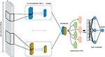

# DeePromoter
Implementation of https://doi.org/10.3389/fgene.2019.00286

Active sequence detection for promoter(DNA subsequence regulates transcription initiation of the gene by controlling the binding of RNA polymerase)

    

    

# Updates