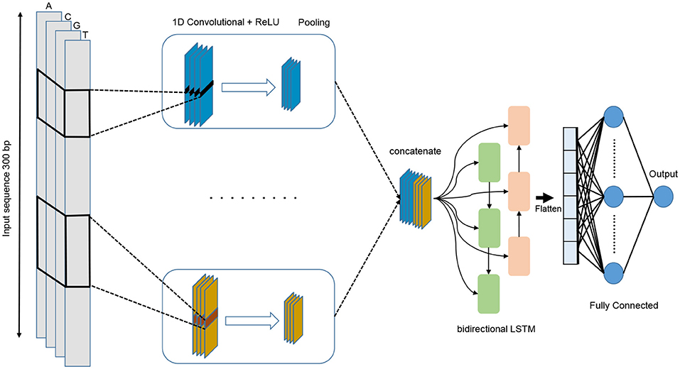
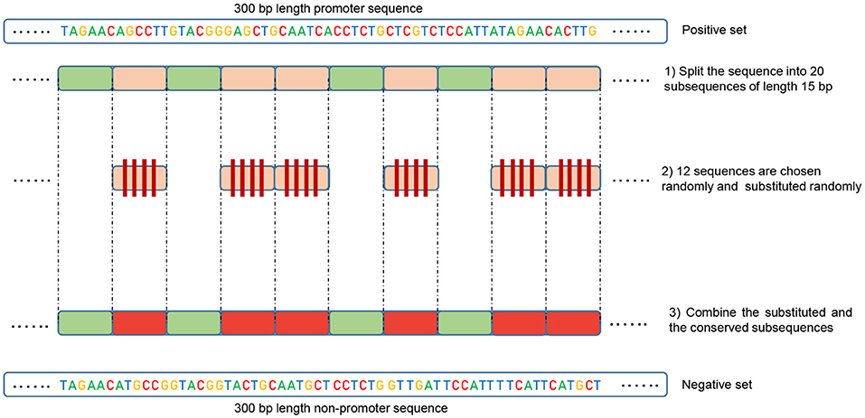

# DeePromoter
Pytorch implementation of [DeePromoter](https://doi.org/10.3389/fgene.2019.00286)
Active sequence detection for promoter(DNA subsequence regulates transcription initiation of the gene by controlling the binding of RNA polymerase)

<p align="center">
    
</p>

# Updates

- 2021-07-08 : Finish training and testing scripts for DeePromoter

# Training 
## Requirements 

- Please install torch==1.9 from https://pytorch.org

- You can install others Python dependencies with

    ```bash
    pip3 install -r requirements.txt
    ```

## Dataset 
Current supported dataset is:
- [EPDnew](https://epd.epfl.ch//index.php) : A collection of experimentally validated promoters for selected model organisms. Evidence comes from TSS-mapping from high-throughput expreriments such as CAGE and Oligocapping

## Preprocessing 

Dataset for Human and Mouse had been processed and stored in ./data

Procedure for create negative dataset as described in paper:

+ Step 1: Break the protein sequence to N part(20 as in the paper)

+ Step 2: Random choose M part of the original protein to keep it, and random initialize the rest

+ Step 3: For every training step mix the positive batch with negative batch and perform training

<p align="center">
    
</p>

##Training 
Train your model with. 

```
python3 train.py -d data/human/nonTATA/hs_pos_nonTATA.txt --experiment_name human_nonTATA
``` 

Early stop had been implement and train will automatically stop when Mathews correlation coefficient is saturated 

The results will be saved in to ./output/experiment_name


You can do continue training by pass the path to weight by flag -w or --weight

## Inference 
Prepare your dataset in txt format with each DNA sequence(length 300) on a line

Run inference by 

``` 
python3 test.py -d data/human/nonTATA/hs_pos_nonTATA.txt -w path_to_weight
``` 

Output will be save into file infer_results.txt in the main folder

## Implementation Issues

### Negative sampling
1. In addition to using negative sampling as in the paper described(see Preprocessing) I added a random dataset to help the model generalize.

### Parallel convolution
1. The author use grid search to find optimal parameters for the network. I used the final set of parameter from the paper.
Kernel size = [27, 14, 7], and maxpooling with kernel = 6

# References
1. [DeePromoter](https://doi.org/10.3389/fgene.2019.00286) paper